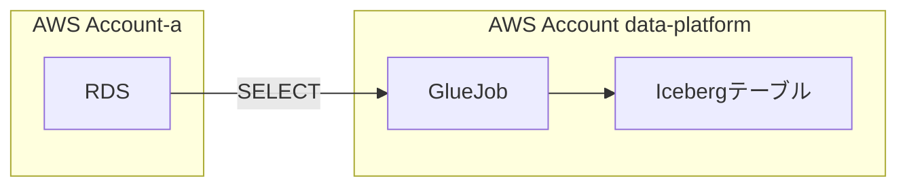
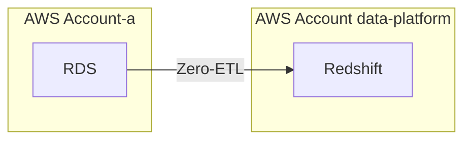
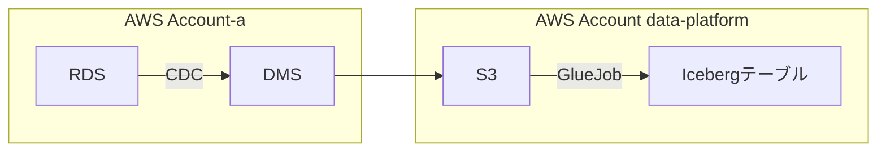
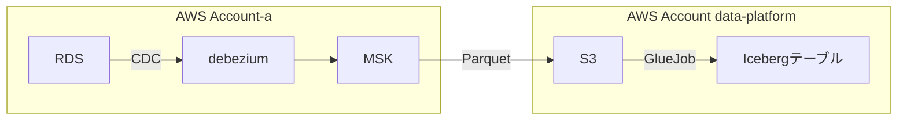
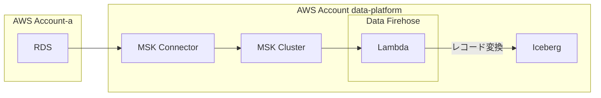
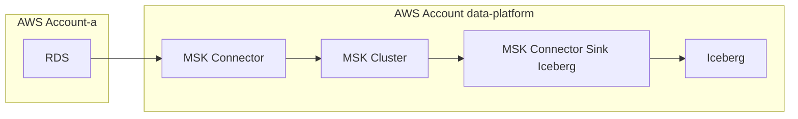
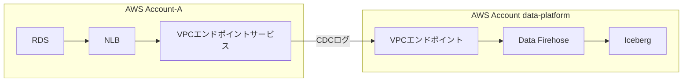
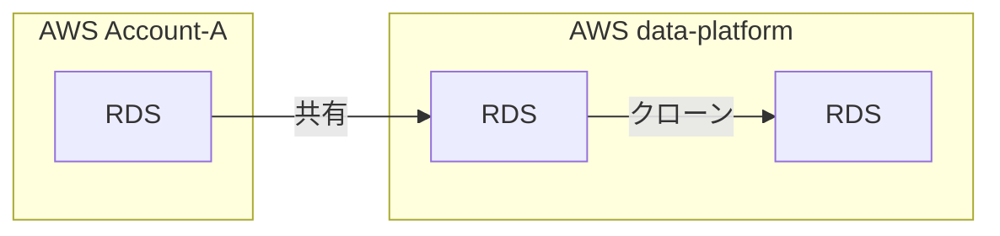

<h3 class="menu-label">ToC</h3>
<!-- toc -->

---

## Overview

There are many ways to replicate RDS table data to analytics tables, so I'll summarize them here.

To minimize the impact on users, there are many approaches to replicating RDS data to analytics tables for analysis, so I'll summarize the Pros/Cons based on my personal opinion.

## Prerequisites

- We separate the AWS account that hosts the application DB from the AWS account where the data platform is built
- Glue tables use the Iceberg format

<!-- more -->

## RDS → Glue Job → Iceberg table

A Glue Job connects to RDS via a Glue Connection, runs queries, and replicates the extracted data to an Iceberg table.

- Pros:
  - Low cost
- Cons:
  - Cannot handle record deletion
    - It can handle logical deletes, but it cannot detect physical deletes
    - You could re-export all the data, or reconcile the RDS side against the Iceberg table to identify deleted records, but this risks straining resources
  - You need to decide on a column to use as the identifier (equivalent to a PK) when fetching data for each table
    - If there is no PK, you need to specify one separately.
    - For example, if there are records that get updated, you need a process that uses `updated_at` as the key to extract the diff
  - Pursuing real-time freshness drives up execution costs

Operational costs are high, making this unsuitable for large-scale DB environments.

## RDS Zero-ETL integration → Redshift

Reference: [Working with Amazon RDS zero-ETL integrations with Amazon Redshift](https://docs.aws.amazon.com/ja_jp/AmazonRDS/latest/UserGuide/zero-etl.html)

RDS Zero-ETL integration replicates to Redshift in a fully managed manner.
Unlike the other approaches, the interface is Redshift rather than an Iceberg table.

- Pros:
  - A fully managed service that requires no scripts
  - Redshift pairs well with dbt
- Cons:
  - High Redshift cost
    - With Serverless, you can probably keep costs down by widening the replication interval, but real-time freshness is lost
  - Anything other than Aurora is unsupported (as of 2024.12.19)

## RDS → DMS → S3 → Glue Job → Iceberg table

Reference: [Modernize your legacy databases with AWS data lakes, Part 2: Build a data lake using AWS DMS data on Apache Iceberg](https://aws.amazon.com/jp/blogs/big-data/modernize-your-legacy-databases-with-aws-data-lakes-part-2-build-a-data-lake-using-aws-dms-data-on-apache-iceberg/)

- Pros:
  - Likely cheaper than Redshift
- Cons:
  - High DMS operational cost (opinion received from an AWS SA)
    - Failures caused by spec differences between versions
    - Relatively frequent version upgrades
    - There's a lot of overhead, such as having to stop replication and recreate tables during version upgrades
  - Data processing (update / insert / delete) by Glue Job becomes complicated
  - You need to handle table schema changes in the Glue Job

Some companies have adopted DMS

- [Cookpad - Continuous data change detection using DMS](https://techlife.cookpad.com/entry/2024/10/16/101605)

## RDS → Debezium → MSK → S3 → Glue Job → Iceberg table

Reference: [Synchronize data lakes with CDC-based UPSERT using open table format, AWS Glue, and Amazon MSK](https://aws.amazon.com/jp/blogs/big-data/synchronize-data-lakes-with-cdc-based-upsert-using-open-table-format-aws-glue-and-amazon-msk/)

MSK stores CDC data as Parquet in S3, and a Glue Job converts it into an Iceberg table.

- Pros:
  - Can handle `MariaDB`, which is unsupported by RDS Zero-ETL
- Cons:
  - High learning cost for Debezium, MSK, etc. (personal impression)
  - Data processing (update / insert / delete) by Glue Job becomes complicated
  - You need to handle table schema changes in the Glue Job

## RDS → Debezium → MSK → Data Firehose → Iceberg table

- Pros:
  - Can handle `MariaDB`, which is unsupported by RDS Zero-ETL
  - You can adjust buffering and handle errors on the Data Firehose side
- Cons:
  - High learning cost for Debezium, MSK, etc. (personal impression)
  - You need to handle table data and schema changes in Lambda
  - You need to create one Data Firehose per table
    - Since billing is based on request volume, there's no cost issue, but management becomes cumbersome
  - You need to create the Iceberg tables in advance

## RDS → Debezium → MSK → Iceberg table

- Pros:
  - No need to manage Data Firehose
    - Solves the "create one Data Firehose per table" problem of "RDS → Debezium → MSK → Data Firehose → Iceberg table"
    - You cannot handle how much request volume there is or any dropped records → but there is an ad hoc snapshot, so it seems fine
  - No need to create tables in advance; they can be created automatically
- Cons:
  - High learning cost for configuring the Iceberg Sink Connector

## RDS → Data Firehose → Iceberg table (preview version)

Reference: [Replicate changes from databases to Apache Iceberg tables using Amazon Data Firehose (preview)](https://aws.amazon.com/jp/blogs/news/replicate-changes-from-databases-to-apache-iceberg-tables-using-amazon-data-firehose/)

- Pros:
  - Low operational and build cost
  - Can consolidate the interface into Iceberg tables on S3
- Cons:
  - As of December 19, 2024, specifying tables with `.*` causes an internal error when there are many tables, making it unsuitable for production use
    - Currently inquiring → it turned out to be an unexpected bug. They recommended specifying all tables explicitly rather than using the wildcard `*`.
  - Requires building PrivateLink

## Sharing and cloning RDS

Share RDS, then create a clone of that shared RDS.
The cloned RDS lets you reference the latest data as of the moment the clone was created.
This is a configuration that's hard to use when real-time freshness is required.

- Pros:
  - Easily reference a snapshot of the latest data
- Cons:
  - Cannot reference data in real time on an ongoing basis
  - Takes at least about 10 minutes to start up

## Conclusion

I have high hopes for RDS → Data Firehose → Iceberg (preview version) thanks to its low operational and build cost.

Among the various approaches, I expect that integration into Iceberg tables using CDC will become the de facto standard.

I'm looking forward to what comes next.

That's all.
I hope this is helpful.
