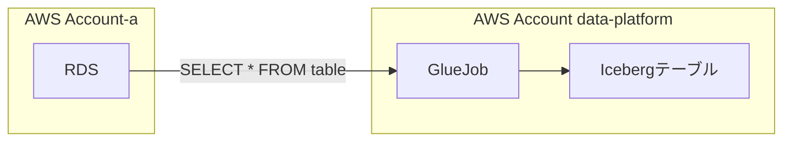
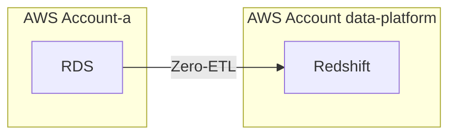
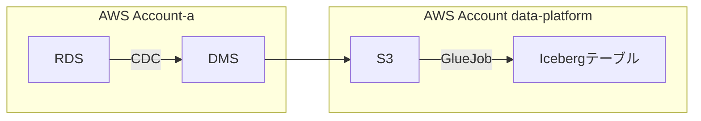
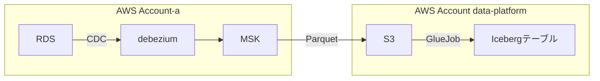
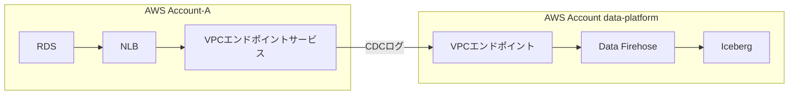
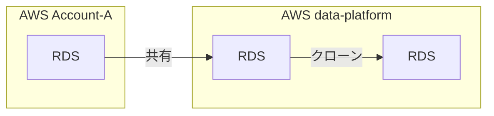

<h3 class="menu-label">ToC</h3>
<!-- toc -->

---

## 概要

RDS のテーブルデータを分析用テーブルにレプリケートする方法が多数あったのでその一覧をまとめます。

RDS をユーザ影響を極力低くすべく、分析用テーブルへレプリケートして、分析する方法が多々あったので私見ですが Pros/Cons をまとめます。

アプリケーション DB を配置する AWS アカウントとデータ基盤を構築する AWS アカウントは分けている前提とします。

<!-- more -->

## RDS→GlueJob→Iceberg テーブル

Glue Job から Glue Connection 経由で RDS に接続し、クエリを実行し、抽出したデータを Iceberg テーブルへレプリケートします。

- Pros:
  - コスト安
- Cons:
  - レコード削除に対応できない
    - 論理削除であれば対応はできるが、物理削除されると検知できない
    - 全データをエクスポートし直す、もしくは、削除されたレコードを特定する様、RDS 側と Iceberg テーブルで突き合わせる方法はあるが、リソース逼迫させてしまう恐れがある
  - テーブル毎にデータ取得時の識別子 (PK 相当) となるカラムを決定する必要がある
    - PK がない場合、別途指定する必要がある。
    - 例えば更新されるレコードがある場合、 updated_at をキーにし、差分抽出するような処理が必要になる
  - リアルタイム性を追求すると実行コストが嵩む

運用コストが高く、大規模な DB 環境には向かない。

## RDS Zero-ETL 統合 Redshift へレプリケート

参考: [Amazon Redshift との Amazon RDS ゼロ ETL 統合での作業](https://docs.aws.amazon.com/ja_jp/AmazonRDS/latest/UserGuide/zero-etl.html)

RDS の Zero-ETL 統合により完全マネージドで Redshift へレプリケートします。
他の手法と異なり、 Iceberg テーブルでなく Redshift がインターフェースになります。

- Pros:
  - 完全マネージドなサービスでスクリプト不要
  - Redshift は dbt との相性が良い
- Cons:
  - Redshift コスト高
    - Serverless でレプリケート間隔を広げることでコストを抑えることはできそうだが、リアルタイム性は損なわれる
  - Aurora 以外はサポート外 (2024.12.19 時点)

## RDS→DMS→S3→GlueJob→Iceberg テーブル

参考: [Modernize your legacy databases with AWS data lakes, Part 2: Build a data lake using AWS DMS data on Apache Iceberg](https://aws.amazon.com/jp/blogs/big-data/modernize-your-legacy-databases-with-aws-data-lakes-part-2-build-a-data-lake-using-aws-dms-data-on-apache-iceberg/)

- Pros:
  - Redshift よりは安く済みそう
- Cons:
  - DMS 運用コストが高い（AWS SA 様より頂いた意見）
    - バージョン毎の仕様差による障害発生
    - 比較的バージョンアップが多い
    - バージョンアップ時にレプリケートを停止し、再度テーブル作り直す必要があるなど手間が多い
  - Glue Job によるデータ処理（更新・追加・削除）が煩雑化する
  - テーブルのスキーマ変更に Glue Job で対応する必要がある

DMS 採用企業はある

- [クックパッド - DMS を利用した継続的なデータ変更検知](https://techlife.cookpad.com/entry/2024/10/16/101605)

## RDS→debezium→MSK→S3→Glue Job→Iceberg テーブル

参考: [Synchronize data lakes with CDC-based UPSERT using open table format, AWS Glue, and Amazon MSK](https://aws.amazon.com/jp/blogs/big-data/synchronize-data-lakes-with-cdc-based-upsert-using-open-table-format-aws-glue-and-amazon-msk/)

MSK で CDC データを Parquet で S3 に保存し、 Glue Job で Iceberg テーブルに変換します。

- Pros:
  - RDS Zero-ETL サポート外の `MariaDB` にも対応できる
- Cons:
  - debezium, MSK 等の学習コストが高い（個人の感想）
  - Glue Job によるデータ処理（更新・追加・削除）が煩雑化する
  - テーブルのスキーマ変更に Glue Job で対応する必要がある

## RDS→Data Firehose→Iceberg テーブル (preview 版)

参考: [Amazon Data Firehose を使用して、データベースから Apache Iceberg テーブルに変更をレプリケート (プレビュー)](https://aws.amazon.com/jp/blogs/news/replicate-changes-from-databases-to-apache-iceberg-tables-using-amazon-data-firehose/)

- Pros:
  - 運用・構築コスト安
  - インターフェースを S3 上の Iceberg テーブルに統合できる
- Cons:
  - 2024 年 12 月 19 日時点では、テーブルを `.*` で指定すると多数テーブルがある場合、内部エラーとなり実運用に向かない
    - 問い合わせ中
  - PrivateLink の構築が必要

## RDS を共有しクローン

RDS を共有し、その共有された RDS をクローン作成します。
クローン実施された時点の最新のデータをクローンされた RDS で参照することができます。
リアルタイム性を求めるには難しい構成です。

- Pros:
  - 簡易に最新データのスナップショットが参照できる
- Cons:
  - 定常的にリアルタイムにデータが参照できない
  - 起動に少なくとも 10 分程度かかる

## 総評

RDS→Data Firehose→Iceberg (preview 版) が運用・構築コスト安で大変期待しています。

様々手法がある中で CDC を利用した Iceberg テーブルへの統合はデファクトになっていく流れにあるかと推察します。

今後がより楽しみです。

以上
参考になれば幸いです。
