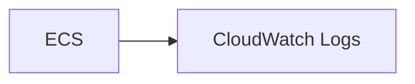
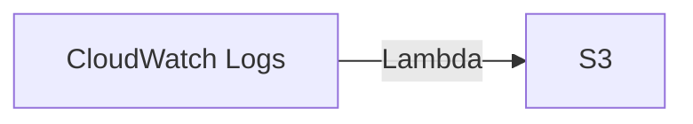
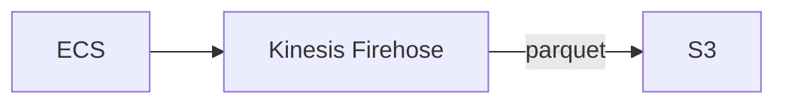
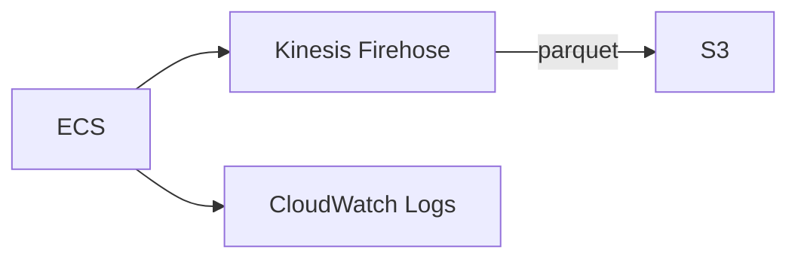
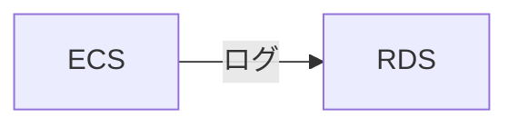

This post describes, from a data analytics perspective, which AWS ECS container logging configurations are convenient for analysis.

Fundamentally, logs are append-only by nature and are never updated or deleted. With that in mind, an architecture designed with this property in view is desirable.

## ECS Container Logging Configurations

### ECS → CloudWatch Logs

This is the configuration you most often see by default.

<!-- more -->

- Pros:
    - Real-time data analysis is possible
    - Easy to set up
- Cons:
    - Incurs the cost of writing logs to CloudWatch Logs
    - Integrated analysis with other data takes some effort

#### Integrated analysis with other data takes some effort?

There is also CloudWatch Logs Insights, and if logs are the only thing you want to analyze, this is not a particular problem. However, when you want to cross-reference with other data, integrated management is required.

Example: When you want to join ALB logs at a specific time and aggregate which URIs were accessed.

You can connect from Athena to CloudWatch using the [Amazon Athena CloudWatch connector](https://docs.aws.amazon.com/ja_jp/athena/latest/ug/connectors-cloudwatch.html), but because it goes through Lambda, there is a limit on the size of a single response Lambda can return. Data that cannot fit in the response is temporarily offloaded (spilled) to S3, which takes time before a complete response is returned and results in poor performance.

#### Transform data with Lambda via a CloudWatch subscription filter and store it in S3

In this case as well, when the processing volume is large, you may need to handle errors caused by Lambda's resource limits, so this is a configuration that is hard to recommend.

### ECS → Kinesis Firehose → S3

This configuration accumulates data in S3 via Kinesis Firehose and references it from Athena.

- Pros:
    - You can take a backup if the transfer to S3 fails
    - When there are a large number of requests, you can make it cheaper than the cost of putting objects into CloudWatch Logs
    - Can be analyzed in an integrated way with Athena
- Cons:
    - Buffering data in Kinesis Firehose (accumulating it under certain conditions) sacrifices real-time performance
        - To keep costs down to some extent, you can buffer for up to 15 minutes and send data to S3 in batches
    - Setup takes some effort

When you need to urgently investigate logs due to an incident, having real-time performance compromised raises operational concerns. It is easy to imagine the stress of not being able to view logs immediately during verification in new development.

From a data analytics standpoint, it integrates well with Athena and has high affinity, but from an actual operations standpoint, it appears to have problems.

### ECS → Kinesis Firehose / CloudWatch Logs Hybrid

By making it hybrid, you create a state where you can ensure real-time performance in light of actual operations while also performing integrated data analysis in Athena.

- Pros:
    - You can ensure both logs for data analysis and real-time logs
- Cons:
    - Incurs the cost of writing logs to CloudWatch Logs
    - Setup takes some effort

It depends on the scale of requests, but when considering an architecture built on the premise of doing data analysis, I think this is about where the sweet spot is.

## A painful configuration you sometimes see

I sometimes see log data being accumulated in a DB.
I imagine the background was something like wanting to produce a real-time access ranking based on that data, but my impression is that it is often a bad move.

If the data is being accumulated with measures in place against data bloat, it is still acceptable. But if not, it is plain to see that it will eventually bloat and degrade performance.

If you were to pull hundreds of millions of records from RDS at once, it would consume DB resources, and in the case of an application DB, it is easy to imagine that it would impact users.

This is a configuration I would rather not see from a data analytics perspective.

It is desirable to first send logs to log storage (e.g., S3) and to separately ensure the data used by the application.

## Overall Assessment

I have introduced the hybrid format that worked out reasonably well in my operation of AWS ECS container logging.

In ECS, I ran fluentbit as a sidecar and routed the logs.

Reference: https://docs.aws.amazon.com/ja_jp/AmazonECS/latest/developerguide/firelens-using-fluentbit.html

That's all.
I hope this is helpful.
