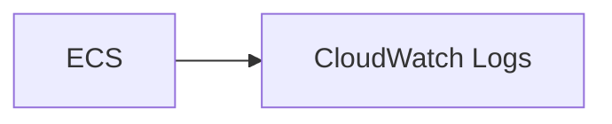
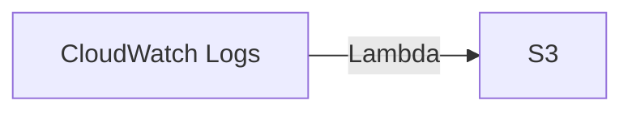
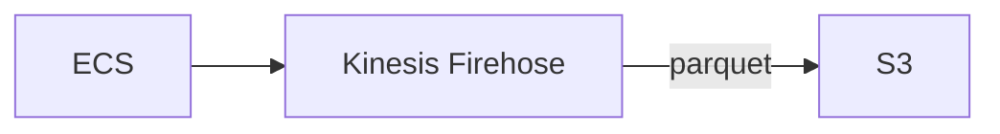
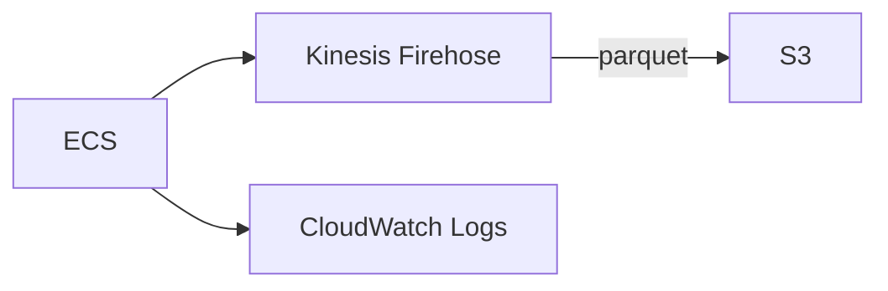
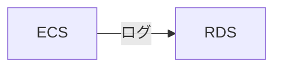

AWS ECS コンテナロギングをデータ分析観点からどの様な構成だと分析に都合が良いかの観点を記載します。

基本ログは追加のみで更新や削除はされない性質があるので、その点を考慮して登録されることを意識したアーキテクチャが望ましいです。

## ECS コンテナロギングの構成

### ECS → CloudWatch Logs

デフォルトではこのような構成がよく見受けられます。

<!-- more -->

- Pros:
    - リアルタイムでデータ分析が可能
    - 簡易的に設定できる
- Cons:
    - CloudWatch Logs へのログ出力コストが掛かる
    - 他データとの統合的な分析は一手間かかる

#### 他データとの統合的な分析は一手間かかる ?

CloudWatch Logs Insight もあり、ログのみを分析対象とする場合であれば特に問題ないですが、
他データと照合したい場合は統合的な管理が必要です。

例: 特定の時刻で ALB のログと付き合わせて、どの URI にアクセスされたかを集計したい場合

[Amazon Athena CloudWatch コネクタ](https://docs.aws.amazon.com/ja_jp/athena/latest/ug/connectors-cloudwatch.html) で
Athena から CloudWatch に接続可能ですが、Lambda を介するので Lambda の一度に返せるレスポンスの制限があり、レスポンスで返せないデータは一度 S3 に退避 (spill) したりすることで完全なレスポンスを返すまでに時間を要し、パフォーマンスが悪くなります。

#### CloudWatch のサブスクリプションフィルターで Lambda でデータ変換し S3 保管

こちらも処理量がお多い場合に Lambda のリソース制限でエラーハンドリングをする必要が出る可能性もあり、あまり利用を推奨しづらい構成です。

### ECS → Kinesis Firehose → S3

Kinesis Firehose 経由で S3 にデータを蓄積し、Athena から参照する構成です。

- Pros:
    - S3転送時に失敗した場合にバックアップが取れる
    - 大量リクエストがある場合、 CloudWatch Logs への put object する料金より安くすることができる
    - Athena で統合して分析可能
- Cons:
    - Kinesis Firehose でデータをバッファリング (一定条件で溜め込む) するとリアルタイム性が損なわれる
        - ある程度コストを抑えるには、最大 15 分のバッファリングが可能なので、まとめて S3 にデータを送信ができる
    - 設定に一手間

障害等で緊急のログ調査が必要な時にリアルタイム性が損なわれた状態では運用に懸念があります。
新規の開発時に検証でログが直ちに閲覧できないストレスは想像に難くありません。
データ分析の観点で言えば、Athena で統合でき、親和性が高いですが、実運用の観点では問題がある様に見えます。

### ECS → Kinesis Firehose / CloudWatch Logs ハイブリッド

ハイブリッドにすることで実運用を鑑みてリアルタイム性を担保しつつもデータ分析を Athena で統合的にデータ分析できる状態ができます。

- Pros:
    - データ分析用のログとリアルタイムのログを担保できる
- Cons:
    - CloudWatch Logs へのログ出力コストが掛かる
    - 設定に一手間

リクエストの規模にもよりますが、データ分析をする、と言う背景を持った上でのアーキテクチャを鑑みるとこの辺りが落とし所かなと思います。

## 時折見る辛い構成

ログデータを DB に溜め込んでいるのを時折見ます。
そのデータを元にリアルタイムにアクセスランキングを出したり、ということをやろうとしたのかな？と背景を想像したりしますが、
悪手である場合が多い印象です。

データ肥大化に対策した上で溜め込んでいるのであれば、まだ良いですが、
そうでなければ、いずれ肥大化してパフォーマンスを落としていくのが目に見えている為です。

RDS から何億レコードを一括で取ろうものなら DB リソースを消費しアプリケーション DB であれば、ユーザ影響を及ぼすことは想像に難くないです。

データ分析の観点からやって欲しくない構成です。

ログは一旦ログストレージ (例: S3)に流し、アプリケーションで利用するデータは別途担保する、というのが望ましいです。

## 総評

AWS ECS コンテナのロギングでの運用してみてほどよかったハイブリッド形式を紹介させていただきました。

ECS ではサイドカーで fluentbit を起動し、ログをルーティングしました。

参考: https://docs.aws.amazon.com/ja_jp/AmazonECS/latest/developerguide/firelens-using-fluentbit.html

以上
参考になれば幸いです。
