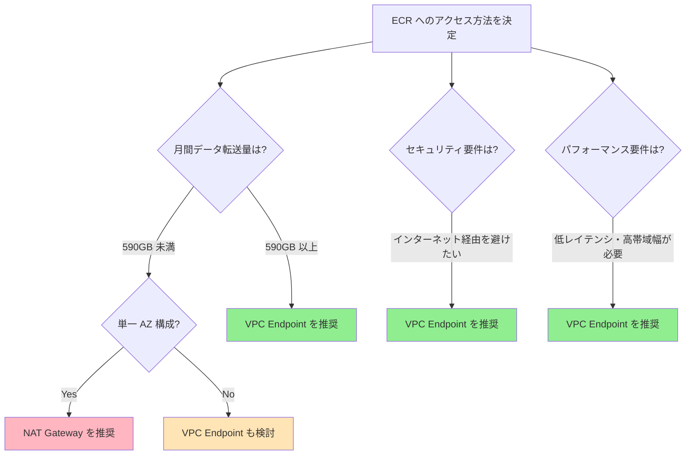

Should you introduce a VPC Interface Endpoint for accessing Amazon ECR (Elastic Container Registry), or should you keep accessing it through a NAT Gateway? This post analyzes the break-even point from a cost perspective and provides guidelines for making the optimal choice.

<!-- more -->

## Overview

When pulling container images from ECR, there are two approaches:

1. **Via NAT Gateway**: Access the public endpoint over the internet
2. **Via VPC Endpoint**: Access within AWS's private network

In this post, we analyze which is more cost-efficient based on the pricing structure in the Tokyo region (ap-northeast-1).

## Comparing the Pricing Structures

### Cost via NAT Gateway

The NAT Gateway pricing in the Tokyo region is as follows:

| Item | Price |
|------|------|
| Hourly charge | $0.062/hour |
| Data processing charge | $0.062/GB |
| Monthly base charge (730 hours) | $45.26/month |

**Monthly cost formula:**
```
NAT Gateway cost = $45.26 + ($0.062 × data transfer GB)
```

### Cost via VPC Interface Endpoint

Fully private access to ECR requires the following three endpoints:

| Endpoint | Type | Hourly charge |
|--------------|--------|------------|
| com.amazonaws.ap-northeast-1.ecr.api | Interface | $0.01/hour |
| com.amazonaws.ap-northeast-1.ecr.dkr | Interface | $0.01/hour |
| com.amazonaws.ap-northeast-1.s3 | Gateway | Free |

**Data processing charge**: $0.01/GB (Interface Endpoints only)

**Monthly cost formula (per AZ):**
```
VPC Endpoint cost = ($0.01 × 2 endpoints × 730 hours) + ($0.01 × data transfer GB)
                   = $14.60 + ($0.01 × data transfer GB)
```

⚠️ **Important**: Be sure to configure the S3 Gateway Endpoint. ECR image layers are stored in S3, and without an S3 Endpoint, the bulk of the data will go through the NAT Gateway, yielding almost no cost savings.

## Calculating the Break-Even Point

### For a 1-AZ Configuration

We solve for the point where NAT Gateway cost = VPC Endpoint cost:

```
$45.26 + ($0.062 × GB) = $14.60 + ($0.01 × GB)
$30.66 = $0.052 × GB
GB = 590GB/month
```

**Break-even point: approximately 590GB/month**

Beyond 590GB/month, the VPC Endpoint becomes more cost-efficient.

### Monthly Cost Comparison Table

| Data transfer/month | NAT Gateway | VPC Endpoint | Difference | Recommendation |
|---------------|-------------|--------------|------|------|
| 100GB | $51.46 | $15.60 | - | NAT Gateway |
| 300GB | $63.86 | $17.60 | - | NAT Gateway |
| 500GB | $76.26 | $19.60 | - | NAT Gateway |
| **590GB** | **$81.84** | **$20.50** | **$0** | **Break-even** |
| 1TB (1,024GB) | $108.75 | $24.84 | $83.91 | **VPC Endpoint** |
| 2TB (2,048GB) | $172.24 | $35.08 | $137.16 | **VPC Endpoint** |
| 5TB (5,120GB) | $362.70 | $65.80 | $296.90 | **VPC Endpoint** |

### Considerations for Multi-AZ Configurations

**For a 3-AZ configuration:**

- NAT Gateway: one needed per AZ → $45.26 × 3 = $135.78/month (base charge only)
- VPC Endpoint: deployed in each AZ → $14.60 × 3 = $43.80/month (base charge only)

In a multi-AZ configuration, the difference in base charges grows even larger, so the VPC Endpoint can be advantageous even with lower data transfer volumes.

**Break-even point for 3 AZs:**
```
($45.26 × 3) + ($0.062 × GB) = ($14.60 × 3) + ($0.01 × GB)
$135.78 + ($0.062 × GB) = $43.80 + ($0.01 × GB)
$91.98 = $0.052 × GB
GB = 1,769GB/month (about 1.77TB)
```

⚠️ **Note**: The above assumes that traffic is evenly distributed across all AZs. In practice, you also need to factor in cross-AZ traffic costs ($0.01/GB).

## Benefits Beyond Cost

### Benefits of the VPC Endpoint

1. **Improved security**
   - No traffic over the internet, reducing the attack surface
   - Traffic control within the VPC is possible

2. **Improved performance**
   - Lower latency since traffic goes over AWS's private network
   - Avoids the NAT Gateway bottleneck

3. **Bandwidth stability**
   - Unaffected by internet-bound traffic
   - More predictable performance

4. **Compliance requirements**
   - Suitable for environments that require data not to traverse the public internet

### Benefits of the NAT Gateway

1. **Simple configuration**
   - Can reuse an existing NAT Gateway as-is
   - No additional endpoint configuration required

2. **Cost-efficient for low traffic**
   - For under 590GB/month, the NAT Gateway is cheaper

## Implementation Best Practices

### Checklist When Introducing a VPC Endpoint

✅ **Required settings:**
1. Create the ECR API Endpoint (com.amazonaws.ap-northeast-1.ecr.api)
2. Create the ECR Docker Endpoint (com.amazonaws.ap-northeast-1.ecr.dkr)
3. Create the S3 Gateway Endpoint (com.amazonaws.ap-northeast-1.s3)
4. Allow HTTPS (443) traffic in the security group
5. Enable private DNS

✅ **Recommended settings:**
- Apply the principle of least privilege in the VPC Endpoint Policy
- Monitor VPC Endpoint traffic with CloudWatch Logs
- Place endpoints in multiple AZs to ensure availability

### Terraform Implementation Example

```hcl
# ECR API Endpoint
resource "aws_vpc_endpoint" "ecr_api" {
  vpc_id              = aws_vpc.main.id
  service_name        = "com.amazonaws.ap-northeast-1.ecr.api"
  vpc_endpoint_type   = "Interface"
  subnet_ids          = aws_subnet.private[*].id
  security_group_ids  = [aws_security_group.vpc_endpoint.id]
  private_dns_enabled = true

  tags = {
    Name = "ecr-api-endpoint"
  }
}

# ECR Docker Endpoint
resource "aws_vpc_endpoint" "ecr_dkr" {
  vpc_id              = aws_vpc.main.id
  service_name        = "com.amazonaws.ap-northeast-1.ecr.dkr"
  vpc_endpoint_type   = "Interface"
  subnet_ids          = aws_subnet.private[*].id
  security_group_ids  = [aws_security_group.vpc_endpoint.id]
  private_dns_enabled = true

  tags = {
    Name = "ecr-dkr-endpoint"
  }
}

# S3 Gateway Endpoint
resource "aws_vpc_endpoint" "s3" {
  vpc_id            = aws_vpc.main.id
  service_name      = "com.amazonaws.ap-northeast-1.s3"
  vpc_endpoint_type = "Gateway"
  route_table_ids   = aws_route_table.private[*].id

  tags = {
    Name = "s3-gateway-endpoint"
  }
}

# Security group for VPC Endpoints
resource "aws_security_group" "vpc_endpoint" {
  name        = "vpc-endpoint-sg"
  description = "Security group for VPC endpoints"
  vpc_id      = aws_vpc.main.id

  ingress {
    from_port   = 443
    to_port     = 443
    protocol    = "tcp"
    cidr_blocks = [aws_vpc.main.cidr_block]
  }

  egress {
    from_port   = 0
    to_port     = 0
    protocol    = "-1"
    cidr_blocks = ["0.0.0.0/0"]
  }

  tags = {
    Name = "vpc-endpoint-sg"
  }
}
```

## Decision Flowchart



## Monitoring and Cost Optimization

### CloudWatch Metrics

#### Key Metrics for the VPC Endpoint

After introducing a VPC Endpoint, monitor the following metrics to measure the cost impact:

| Metric name | Description | Unit | Recommended action |
|------------|------|------|--------------|
| **BytesProcessed** | Bytes processed by the VPC Endpoint | Bytes | Analyze monthly trends and use for cost forecasting |
| **PacketsProcessed** | Number of packets processed | Count | Performance monitoring, anomaly detection |
| **ActiveConnections** | Number of active connections | Count | Capacity planning |

**Commands to check data transfer volume:**

```bash
# Check VPC Endpoint byte count (ECR API)
aws cloudwatch get-metric-statistics \
  --namespace AWS/PrivateLink \
  --metric-name BytesProcessed \
  --dimensions Name=ServiceName,Value=com.amazonaws.ap-northeast-1.ecr.api \
  --start-time 2026-04-01T00:00:00Z \
  --end-time 2026-04-30T23:59:59Z \
  --period 86400 \
  --statistics Sum \
  --region ap-northeast-1

# Check VPC Endpoint byte count (ECR Docker)
aws cloudwatch get-metric-statistics \
  --namespace AWS/PrivateLink \
  --metric-name BytesProcessed \
  --dimensions Name=ServiceName,Value=com.amazonaws.ap-northeast-1.ecr.dkr \
  --start-time 2026-04-01T00:00:00Z \
  --end-time 2026-04-30T23:59:59Z \
  --period 86400 \
  --statistics Sum \
  --region ap-northeast-1
```

#### Key Metrics for the NAT Gateway

If you are using a NAT Gateway, monitor the following metrics:

| Metric name | Description | Unit | Recommended action |
|------------|------|------|--------------|
| **BytesInFromDestination** | Bytes received from the internet | Bytes | Cost calculation, trend analysis |
| **BytesInFromSource** | Bytes received from the VPC | Bytes | Cost calculation, trend analysis |
| **BytesOutToDestination** | Bytes sent to the internet | Bytes | Understand ECR pull volume |
| **BytesOutToSource** | Bytes sent to the VPC | Bytes | Understand internal traffic |
| **ActiveConnectionCount** | Number of concurrent connections | Count | Monitor peak times |
| **ConnectionAttemptCount** | Number of connection attempts | Count | Analyze connection patterns |
| **ErrorPortAllocation** | Number of port allocation errors | Count | Early detection of capacity shortages |
| **PacketsDropCount** | Number of dropped packets | Count | Detect performance problems |

**Command to check NAT Gateway data transfer volume:**

```bash
# Check NAT Gateway outbound byte count
aws cloudwatch get-metric-statistics \
  --namespace AWS/NATGateway \
  --metric-name BytesOutToDestination \
  --dimensions Name=NatGatewayId,Value=nat-xxxxxxxxxxxxxxxxx \
  --start-time 2026-04-01T00:00:00Z \
  --end-time 2026-04-30T23:59:59Z \
  --period 86400 \
  --statistics Sum \
  --region ap-northeast-1
```

#### CloudWatch Insights Query Example

An Insights query to compare and analyze VPC Endpoint and NAT Gateway traffic:

```
# Daily data transfer volume for the VPC Endpoint
fields @timestamp, BytesProcessed
| filter ServiceName = "com.amazonaws.ap-northeast-1.ecr.api"
| stats sum(BytesProcessed) as TotalBytes by bin(1d)
| sort @timestamp desc
```

#### Recommended CloudWatch Alarm Configuration

For cost management, we recommend configuring the following alarms:

```bash
# Alarm for when the VPC Endpoint's monthly data transfer exceeds a threshold
aws cloudwatch put-metric-alarm \
  --alarm-name "ecr-vpc-endpoint-monthly-data-transfer" \
  --alarm-description "VPC Endpoint monthly data transfer exceeds threshold" \
  --metric-name BytesProcessed \
  --namespace AWS/PrivateLink \
  --statistic Sum \
  --period 2592000 \
  --evaluation-periods 1 \
  --threshold 1099511627776 \
  --comparison-operator GreaterThanThreshold \
  --dimensions Name=ServiceName,Value=com.amazonaws.ap-northeast-1.ecr.api \
  --alarm-actions arn:aws:sns:ap-northeast-1:123456789012:cost-alerts \
  --region ap-northeast-1

# Detect NAT Gateway port allocation errors
aws cloudwatch put-metric-alarm \
  --alarm-name "nat-gateway-port-allocation-errors" \
  --alarm-description "NAT Gateway port allocation errors detected" \
  --metric-name ErrorPortAllocation \
  --namespace AWS/NATGateway \
  --statistic Sum \
  --period 300 \
  --evaluation-periods 2 \
  --threshold 0 \
  --comparison-operator GreaterThanThreshold \
  --dimensions Name=NatGatewayId,Value=nat-xxxxxxxxxxxxxxxxx \
  --alarm-actions arn:aws:sns:ap-northeast-1:123456789012:infrastructure-alerts \
  --region ap-northeast-1
```

### Cost Tracking with Cost Explorer

In AWS Cost Explorer, filter by the following to verify the actual cost savings:

- Service: Amazon EC2 (VPC Endpoint)
- Usage type: contains "VpcEndpoint"
- Region: ap-northeast-1

## Frequently Asked Questions (FAQ)

**Q: Will there be downtime when switching from an existing NAT Gateway to a VPC Endpoint?**

A: With proper implementation, you can migrate with no downtime. By creating the VPC Endpoint and enabling private DNS, traffic automatically routes through the VPC Endpoint without any changes on the application side.

**Q: Do I still need a NAT Gateway after creating a VPC Endpoint?**

A: If you only access ECR, a NAT Gateway is unnecessary. However, if you have other internet-bound traffic (downloading packages, accessing external APIs, etc.), you will need a NAT Gateway or an alternative.

**Q: Is the S3 Gateway Endpoint really free?**

A: Yes, the S3 Gateway Endpoint itself has no charge. However, S3 data transfer fees and request fees apply separately.

**Q: What about multi-region configurations?**

A: VPC Endpoints are region-specific resources. If you use ECR in multiple regions, you need to create a VPC Endpoint in each region.

## Summary

The break-even point for a VPC Interface Endpoint for ECR is **approximately 590GB/month**.

**Recommendations:**

✅ **When to recommend a VPC Endpoint:**
- Monthly ECR data transfer of 590GB or more
- High traffic in a multi-AZ configuration
- Security requirements that avoid routing over the internet
- Low latency and high performance are required

✅ **When to keep the NAT Gateway:**
- Monthly ECR data transfer under 590GB
- Low traffic in a single-AZ configuration
- You want to maintain a simple configuration

**Key points:**
1. ECR requires all **three endpoints** (ecr.api, ecr.dkr, s3)
2. Forgetting the S3 Gateway Endpoint yields almost no cost savings
3. In multi-AZ configurations, the large difference in base charges means you reach the break-even point sooner

Cost optimization is a continuous process. It's important to leverage AWS Cost Explorer and CloudWatch metrics to regularly review actual usage and maintain the optimal configuration.

## Reference Links

- [AWS PrivateLink Pricing](https://aws.amazon.com/privatelink/pricing/)
- [Amazon VPC Pricing](https://aws.amazon.com/vpc/pricing/)
- [NAT Gateway Pricing Documentation](https://docs.aws.amazon.com/vpc/latest/userguide/nat-gateway-pricing.html)
- [NAT Gateways Killing Your Container Costs?](https://dev.to/hstiwana/nat-gateways-killing-your-container-costs-amazon-ecr-vpc-endpoints-to-the-rescue-21k5)
- [VPC Endpoints Cost Comparison Guide](https://pcg.io/insights/vpc-endpoints-explanation-and-cost-comparison/)
- [AWS NAT Gateway Pricing Guide](https://cloudburn.io/blog/aws-nat-gateway-pricing)
- [VPC Endpoint for ECR - AWS Documentation](https://docs.aws.amazon.com/AmazonECR/latest/userguide/vpc-endpoints.html)

---

*This article is based on the official AWS documentation and several cost analysis articles. Prices are as of April 2026; for the latest information, please check the official AWS website.*
