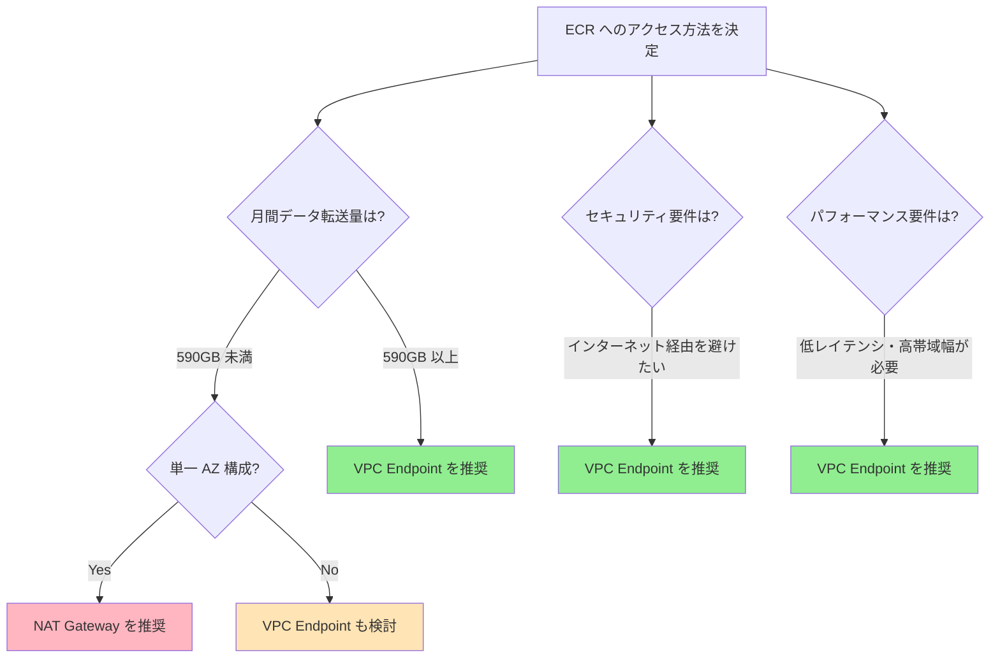

Amazon ECR（Elastic Container Registry）へのアクセスに VPC Interface Endpoint を導入すべきか、NAT Gateway 経由でアクセスを続けるべきか。コスト面から損益分岐点を分析し、最適な選択をするためのガイドラインをまとめます。

<!-- more -->

## 概要

コンテナイメージを ECR から取得する際、以下の2つのアプローチがあります：

1. **NAT Gateway 経由**: インターネット経由でパブリックエンドポイントにアクセス
2. **VPC Endpoint 経由**: AWS のプライベートネットワーク内でアクセス

本記事では、東京リージョン（ap-northeast-1）における料金体系を基に、どちらがコスト効率的かを分析します。

## 料金体系の比較

### NAT Gateway 経由のコスト

東京リージョンにおける NAT Gateway の料金は以下の通りです：

| 項目 | 料金 |
|------|------|
| 時間単位料金 | $0.062/時間 |
| データ処理料金 | $0.062/GB |
| 月間基本料金（730時間） | $45.26/月 |

**月間コスト計算式：**
```
NAT Gateway コスト = $45.26 + ($0.062 × データ転送量 GB)
```

### VPC Interface Endpoint 経由のコスト

ECR への完全なプライベートアクセスには、以下の3つのエンドポイントが必要です：

| エンドポイント | タイプ | 時間単位料金 |
|--------------|--------|------------|
| com.amazonaws.ap-northeast-1.ecr.api | Interface | $0.01/時間 |
| com.amazonaws.ap-northeast-1.ecr.dkr | Interface | $0.01/時間 |
| com.amazonaws.ap-northeast-1.s3 | Gateway | 無料 |

**データ処理料金**: $0.01/GB（Interface Endpoint のみ）

**月間コスト計算式（1 AZ あたり）：**
```
VPC Endpoint コスト = ($0.01 × 2エンドポイント × 730時間) + ($0.01 × データ転送量 GB)
                   = $14.60 + ($0.01 × データ転送量 GB)
```

⚠️ **重要**: S3 Gateway Endpoint を必ず設定してください。ECR のイメージレイヤーは S3 に保存されており、S3 Endpoint がない場合、大部分のデータが NAT Gateway 経由となり、コスト削減効果がほとんど得られません。

## 損益分岐点の計算

### 1 AZ 構成の場合

NAT Gateway コスト = VPC Endpoint コスト として計算します：

```
$45.26 + ($0.062 × GB) = $14.60 + ($0.01 × GB)
$30.66 = $0.052 × GB
GB = 590GB/月
```

**損益分岐点: 約590GB/月**

590GB/月を超える場合、VPC Endpoint の方がコスト効率が良くなります。

### 月間コスト比較表

| データ転送量/月 | NAT Gateway | VPC Endpoint | 差額 | 推奨 |
|---------------|-------------|--------------|------|------|
| 100GB | $51.46 | $15.60 | - | NAT Gateway |
| 300GB | $63.86 | $17.60 | - | NAT Gateway |
| 500GB | $76.26 | $19.60 | - | NAT Gateway |
| **590GB** | **$81.84** | **$20.50** | **$0** | **損益分岐点** |
| 1TB (1,024GB) | $108.75 | $24.84 | $83.91 | **VPC Endpoint** |
| 2TB (2,048GB) | $172.24 | $35.08 | $137.16 | **VPC Endpoint** |
| 5TB (5,120GB) | $362.70 | $65.80 | $296.90 | **VPC Endpoint** |

### マルチ AZ 構成の考慮点

**3 AZ 構成の場合：**

- NAT Gateway: 各 AZ に1つずつ必要 → $45.26 × 3 = $135.78/月（基本料金のみ）
- VPC Endpoint: 各 AZ に展開される → $14.60 × 3 = $43.80/月（基本料金のみ）

マルチ AZ 構成では、基本料金の差がさらに大きくなるため、データ転送量が少なくても VPC Endpoint が有利になる可能性があります。

**3 AZ での損益分岐点：**
```
($45.26 × 3) + ($0.062 × GB) = ($14.60 × 3) + ($0.01 × GB)
$135.78 + ($0.062 × GB) = $43.80 + ($0.01 × GB)
$91.98 = $0.052 × GB
GB = 1,769GB/月（約1.77TB）
```

⚠️ **注意**: 上記は全 AZ で均等にトラフィックが発生する前提です。実際には、クロス AZ トラフィックコスト（$0.01/GB）も考慮する必要があります。

## コスト以外のメリット

### VPC Endpoint のメリット

1. **セキュリティの向上**
   - インターネットを経由しないため、攻撃対象領域を削減
   - VPC 内でのトラフィック制御が可能

2. **パフォーマンスの向上**
   - AWS のプライベートネットワーク経由のため、レイテンシが低い
   - NAT Gateway のボトルネックを回避

3. **帯域幅の安定性**
   - インターネット経由のトラフィックに影響されない
   - より予測可能なパフォーマンス

4. **コンプライアンス要件**
   - データがパブリックインターネットを経由しないことを要求される環境に対応

### NAT Gateway のメリット

1. **シンプルな構成**
   - 既存の NAT Gateway をそのまま利用可能
   - 追加のエンドポイント設定が不要

2. **少量のトラフィックではコスト効率が良い**
   - 月間590GB未満の場合は NAT Gateway の方が安価

## 実装のベストプラクティス

### VPC Endpoint 導入時のチェックリスト

✅ **必須設定：**
1. ECR API Endpoint（com.amazonaws.ap-northeast-1.ecr.api）を作成
2. ECR Docker Endpoint（com.amazonaws.ap-northeast-1.ecr.dkr）を作成
3. S3 Gateway Endpoint（com.amazonaws.ap-northeast-1.s3）を作成
4. セキュリティグループで HTTPS（443）トラフィックを許可
5. プライベート DNS を有効化

✅ **推奨設定：**
- VPC Endpoint Policy で最小権限の原則を適用
- CloudWatch Logs で VPC Endpoint のトラフィックを監視
- 複数の AZ に Endpoint を配置して可用性を確保

### Terraform 実装例

```hcl
# ECR API Endpoint
resource "aws_vpc_endpoint" "ecr_api" {
  vpc_id              = aws_vpc.main.id
  service_name        = "com.amazonaws.ap-northeast-1.ecr.api"
  vpc_endpoint_type   = "Interface"
  subnet_ids          = aws_subnet.private[*].id
  security_group_ids  = [aws_security_group.vpc_endpoint.id]
  private_dns_enabled = true

  tags = {
    Name = "ecr-api-endpoint"
  }
}

# ECR Docker Endpoint
resource "aws_vpc_endpoint" "ecr_dkr" {
  vpc_id              = aws_vpc.main.id
  service_name        = "com.amazonaws.ap-northeast-1.ecr.dkr"
  vpc_endpoint_type   = "Interface"
  subnet_ids          = aws_subnet.private[*].id
  security_group_ids  = [aws_security_group.vpc_endpoint.id]
  private_dns_enabled = true

  tags = {
    Name = "ecr-dkr-endpoint"
  }
}

# S3 Gateway Endpoint
resource "aws_vpc_endpoint" "s3" {
  vpc_id            = aws_vpc.main.id
  service_name      = "com.amazonaws.ap-northeast-1.s3"
  vpc_endpoint_type = "Gateway"
  route_table_ids   = aws_route_table.private[*].id

  tags = {
    Name = "s3-gateway-endpoint"
  }
}

# VPC Endpoint 用セキュリティグループ
resource "aws_security_group" "vpc_endpoint" {
  name        = "vpc-endpoint-sg"
  description = "Security group for VPC endpoints"
  vpc_id      = aws_vpc.main.id

  ingress {
    from_port   = 443
    to_port     = 443
    protocol    = "tcp"
    cidr_blocks = [aws_vpc.main.cidr_block]
  }

  egress {
    from_port   = 0
    to_port     = 0
    protocol    = "-1"
    cidr_blocks = ["0.0.0.0/0"]
  }

  tags = {
    Name = "vpc-endpoint-sg"
  }
}
```

## 意思決定フローチャート



## モニタリングとコスト最適化

### CloudWatch メトリクス

#### VPC Endpoint の主要メトリクス

VPC Endpoint を導入後、以下のメトリクスを監視してコスト効果を測定します：

| メトリクス名 | 説明 | 単位 | 推奨アクション |
|------------|------|------|--------------|
| **BytesProcessed** | VPC Endpoint で処理されたバイト数 | Bytes | 月次でトレンド分析し、コスト予測に使用 |
| **PacketsProcessed** | 処理されたパケット数 | Count | パフォーマンス監視、異常検知 |
| **ActiveConnections** | アクティブな接続数 | Count | キャパシティプランニング |

**データ転送量の確認コマンド：**

```bash
# VPC Endpoint のバイト数を確認（ECR API）
aws cloudwatch get-metric-statistics \
  --namespace AWS/PrivateLink \
  --metric-name BytesProcessed \
  --dimensions Name=ServiceName,Value=com.amazonaws.ap-northeast-1.ecr.api \
  --start-time 2026-04-01T00:00:00Z \
  --end-time 2026-04-30T23:59:59Z \
  --period 86400 \
  --statistics Sum \
  --region ap-northeast-1

# VPC Endpoint のバイト数を確認（ECR Docker）
aws cloudwatch get-metric-statistics \
  --namespace AWS/PrivateLink \
  --metric-name BytesProcessed \
  --dimensions Name=ServiceName,Value=com.amazonaws.ap-northeast-1.ecr.dkr \
  --start-time 2026-04-01T00:00:00Z \
  --end-time 2026-04-30T23:59:59Z \
  --period 86400 \
  --statistics Sum \
  --region ap-northeast-1
```

#### NAT Gateway の主要メトリクス

NAT Gateway を使用している場合、以下のメトリクスを監視します：

| メトリクス名 | 説明 | 単位 | 推奨アクション |
|------------|------|------|--------------|
| **BytesInFromDestination** | インターネットから受信したバイト数 | Bytes | コスト計算、トレンド分析 |
| **BytesInFromSource** | VPC から受信したバイト数 | Bytes | コスト計算、トレンド分析 |
| **BytesOutToDestination** | インターネットへ送信したバイト数 | Bytes | ECR プル量の把握 |
| **BytesOutToSource** | VPC へ送信したバイト数 | Bytes | 内部トラフィックの把握 |
| **ActiveConnectionCount** | 同時接続数 | Count | ピーク時の監視 |
| **ConnectionAttemptCount** | 接続試行回数 | Count | 接続パターンの分析 |
| **ErrorPortAllocation** | ポート割り当てエラー数 | Count | キャパシティ不足の早期検知 |
| **PacketsDropCount** | ドロップされたパケット数 | Count | パフォーマンス問題の検知 |

**NAT Gateway のデータ転送量確認コマンド：**

```bash
# NAT Gateway の送信バイト数を確認
aws cloudwatch get-metric-statistics \
  --namespace AWS/NATGateway \
  --metric-name BytesOutToDestination \
  --dimensions Name=NatGatewayId,Value=nat-xxxxxxxxxxxxxxxxx \
  --start-time 2026-04-01T00:00:00Z \
  --end-time 2026-04-30T23:59:59Z \
  --period 86400 \
  --statistics Sum \
  --region ap-northeast-1
```

#### CloudWatch Insights クエリ例

VPC Endpoint と NAT Gateway のトラフィックを比較分析するための Insights クエリ：

```
# VPC Endpoint の日次データ転送量
fields @timestamp, BytesProcessed
| filter ServiceName = "com.amazonaws.ap-northeast-1.ecr.api"
| stats sum(BytesProcessed) as TotalBytes by bin(1d)
| sort @timestamp desc
```

#### CloudWatch Alarms の設定推奨

コスト管理のために以下のアラームを設定することを推奨します：

```bash
# VPC Endpoint の月次データ転送量が閾値を超えた場合のアラーム
aws cloudwatch put-metric-alarm \
  --alarm-name "ecr-vpc-endpoint-monthly-data-transfer" \
  --alarm-description "VPC Endpoint monthly data transfer exceeds threshold" \
  --metric-name BytesProcessed \
  --namespace AWS/PrivateLink \
  --statistic Sum \
  --period 2592000 \
  --evaluation-periods 1 \
  --threshold 1099511627776 \
  --comparison-operator GreaterThanThreshold \
  --dimensions Name=ServiceName,Value=com.amazonaws.ap-northeast-1.ecr.api \
  --alarm-actions arn:aws:sns:ap-northeast-1:123456789012:cost-alerts \
  --region ap-northeast-1

# NAT Gateway のポート割り当てエラー検知
aws cloudwatch put-metric-alarm \
  --alarm-name "nat-gateway-port-allocation-errors" \
  --alarm-description "NAT Gateway port allocation errors detected" \
  --metric-name ErrorPortAllocation \
  --namespace AWS/NATGateway \
  --statistic Sum \
  --period 300 \
  --evaluation-periods 2 \
  --threshold 0 \
  --comparison-operator GreaterThanThreshold \
  --dimensions Name=NatGatewayId,Value=nat-xxxxxxxxxxxxxxxxx \
  --alarm-actions arn:aws:sns:ap-northeast-1:123456789012:infrastructure-alerts \
  --region ap-northeast-1
```

### Cost Explorer でのコスト追跡

AWS Cost Explorer で以下をフィルタリングして、実際のコスト削減効果を確認します：

- サービス: Amazon EC2（VPC Endpoint）
- 使用タイプ: 「VpcEndpoint」を含む
- リージョン: ap-northeast-1

## よくある質問（FAQ）

**Q: 既存の NAT Gateway から VPC Endpoint に切り替える際、ダウンタイムは発生しますか？**

A: 適切に実装すれば、ダウンタイムなしで移行可能です。VPC Endpoint を作成し、プライベート DNS を有効化することで、アプリケーション側の変更なしに自動的に VPC Endpoint 経由になります。

**Q: VPC Endpoint を作成しても NAT Gateway が必要ですか？**

A: ECR へのアクセスのみであれば NAT Gateway は不要です。ただし、他のインターネット向けトラフィック（パッケージのダウンロード、外部 API へのアクセスなど）がある場合は、NAT Gateway または代替手段が必要です。

**Q: S3 Gateway Endpoint は本当に無料ですか？**

A: はい、S3 Gateway Endpoint 自体に料金はかかりません。ただし、S3 のデータ転送料金やリクエスト料金は別途発生します。

**Q: マルチリージョン構成の場合は？**

A: VPC Endpoint はリージョン固有のリソースです。複数リージョンで ECR を使用する場合、各リージョンで VPC Endpoint を作成する必要があります。

## まとめ

ECR 用 VPC Interface Endpoint の損益分岐点は**月間約590GB**です。

**推奨事項：**

✅ **VPC Endpoint を推奨する場合：**
- 月間 ECR データ転送量が 590GB 以上
- マルチ AZ 構成で高トラフィック
- セキュリティ要件でインターネット経由を避けたい
- 低レイテンシ・高パフォーマンスが求められる

✅ **NAT Gateway を継続する場合：**
- 月間 ECR データ転送量が 590GB 未満
- 単一 AZ 構成で低トラフィック
- シンプルな構成を維持したい

**重要なポイント：**
1. ECR 用には **3つのエンドポイント**（ecr.api、ecr.dkr、s3）すべてが必要
2. S3 Gateway Endpoint を忘れると、コスト削減効果がほとんど得られない
3. マルチ AZ 構成では基本料金の差が大きいため、より早く損益分岐点に達する

コスト最適化は継続的なプロセスです。AWS Cost Explorer や CloudWatch メトリクスを活用して、実際の使用状況を定期的に確認し、最適な構成を維持することが重要です。

## 参考リンク

- [AWS PrivateLink Pricing](https://aws.amazon.com/privatelink/pricing/)
- [Amazon VPC Pricing](https://aws.amazon.com/vpc/pricing/)
- [NAT Gateway Pricing Documentation](https://docs.aws.amazon.com/vpc/latest/userguide/nat-gateway-pricing.html)
- [NAT Gateways Killing Your Container Costs?](https://dev.to/hstiwana/nat-gateways-killing-your-container-costs-amazon-ecr-vpc-endpoints-to-the-rescue-21k5)
- [VPC Endpoints Cost Comparison Guide](https://pcg.io/insights/vpc-endpoints-explanation-and-cost-comparison/)
- [AWS NAT Gateway Pricing Guide](https://cloudburn.io/blog/aws-nat-gateway-pricing)
- [VPC Endpoint for ECR - AWS Documentation](https://docs.aws.amazon.com/AmazonECR/latest/userguide/vpc-endpoints.html)

---

*この記事は AWS 公式ドキュメントおよび複数のコスト分析記事に基づいて作成されています。料金は 2026年4月時点のものであり、最新の情報については AWS 公式サイトをご確認ください。*
